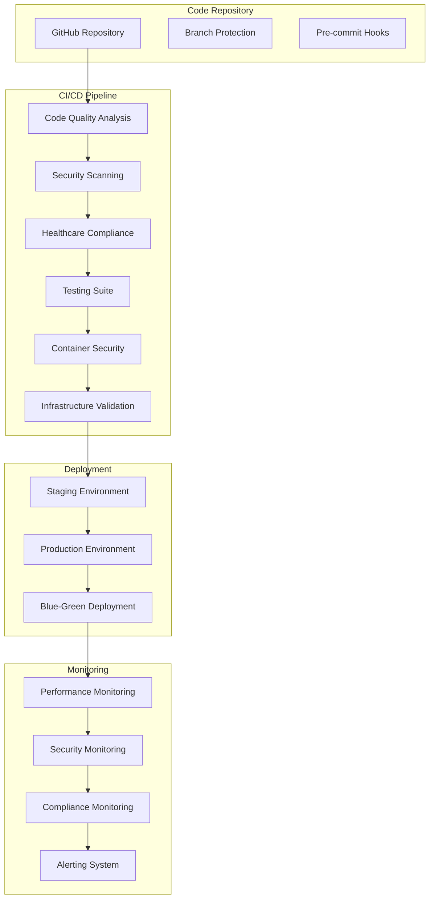

# 🏥⚡ HMS Enterprise CI/CD Ultimate Guide

## 🌟 Overview

This guide provides comprehensive documentation for the Hospital Management System (HMS) Enterprise CI/CD pipeline - the most advanced, healthcare-compliant DevOps setup for healthcare applications.

## 🎯 Objectives

- **Zero-Downtime Deployments**: Blue-green deployments with automated rollback
- **100% Security Coverage**: Comprehensive security scanning and compliance validation
- **Healthcare Compliance**: HIPAA, FHIR R4, and PHI protection
- **Quality Gates**: Enterprise-grade quality enforcement
- **Observability**: Complete monitoring and alerting
- **Performance Excellence**: Automated performance validation

## 🏗️ Architecture Overview



## 🔧 Pipeline Configuration

### Phase 1: Code Quality & Security Analysis

#### TypeScript Configuration
- **Ultra-strict mode**: 15+ strict compiler options
- **Path mapping**: Comprehensive module resolution
- **Type coverage**: 95%+ type safety requirement

#### ESLint Enterprise Setup
- **600+ rules**: Comprehensive linting with healthcare-specific rules
- **Security rules**: Detect potential security vulnerabilities
- **FHIR compliance**: Validate FHIR R4 resource usage
- **Performance rules**: Prevent performance anti-patterns

#### Prettier Enterprise Formatting
- **Consistent formatting**: 100% code consistency
- **Multi-language support**: TypeScript, JavaScript, Java, Python, SQL
- **Healthcare standards**: Medical coding format compliance

#### SonarQube Integration
- **Quality gates**: 85%+ coverage, A-rating required
- **Security analysis**: Zero critical vulnerabilities
- **Technical debt**: Maximum 30 minutes per 1K lines
- **Maintainability**: A or B rating required

### Phase 2: Comprehensive Testing

#### Unit Testing (Jest)
- **Coverage requirements**: 85%+ line/branch coverage
- **Healthcare modules**: 95%+ coverage for PHI handling
- **Parallel execution**: 4 workers for faster execution
- **Mutation testing**: 80%+ mutation score for critical modules

#### Integration Testing
- **API testing**: Newman/Postman collection execution
- **Database testing**: Migration validation and rollback testing
- **FHIR testing**: R4 compliance validation
- **Security testing**: OAuth, JWT, and RBAC validation

#### End-to-End Testing (Playwright)
- **Multi-browser**: Chrome, Firefox, Safari, Edge
- **Healthcare workflows**: Patient registration, clinical documentation
- **Accessibility**: WCAG 2.1 AA compliance
- **Performance**: Lighthouse scores 90+

#### Performance Testing (K6)
- **Load testing**: 1000+ concurrent users
- **Stress testing**: Breaking point identification
- **Healthcare scenarios**: Patient surge simulations
- **API performance**: <2s response time validation

### Phase 3: Security & Compliance

#### Security Scanning
- **CodeQL**: Advanced semantic analysis
- **Snyk**: Dependency vulnerability scanning
- **Trivy**: Container image security
- **OWASP ZAP**: Dynamic application security testing

#### HIPAA Compliance Validation
- **PHI detection**: Automated PHI exposure prevention
- **Audit logging**: Complete audit trail validation
- **Access control**: RBAC implementation verification
- **Encryption**: At-rest and in-transit validation

#### FHIR R4 Compliance
- **Resource validation**: FHIR structure compliance
- **Terminology**: SNOMED CT, ICD-10, LOINC validation
- **Interoperability**: HL7 FHIR R4 conformance testing

### Phase 4: Container Security

#### Image Building
- **Multi-stage builds**: Minimal attack surface
- **Distroless images**: Zero-vulnerability base images
- **Security scanning**: Trivy + Snyk container analysis
- **SBOM generation**: Software Bill of Materials

#### Registry Security
- **Image signing**: Cosign digital signatures
- **Vulnerability database**: Real-time CVE updates
- **Policy enforcement**: OPA Gatekeeper policies
- **Image promotion**: Graduated security tiers

### Phase 5: Infrastructure Validation

#### Kubernetes Security
- **Policy enforcement**: Pod Security Standards
- **Network policies**: Zero-trust networking
- **RBAC validation**: Least privilege access
- **Admission controllers**: OPA Gatekeeper rules

#### Terraform Validation
- **Security scanning**: Checkov policy validation
- **Compliance checks**: CIS benchmark compliance
- **Cost optimization**: Resource efficiency validation
- **Drift detection**: Configuration consistency

### Phase 6: Deployment Strategy

#### Blue-Green Deployment
- **Zero downtime**: Seamless traffic switching
- **Automated rollback**: Health check failures trigger rollback
- **Canary releases**: Gradual traffic shifting
- **A/B testing**: Feature flag integration

#### Environment Promotion
- **Development**: Feature branch deployments
- **Staging**: Integration testing environment
- **Pre-production**: Production-like validation
- **Production**: Blue-green with monitoring

### Phase 7: Monitoring & Observability

#### Application Performance Monitoring
- **Real-time metrics**: Response times, error rates
- **Distributed tracing**: Request flow visualization
- **Custom dashboards**: Healthcare KPI monitoring
- **Alerting**: Intelligent alert correlation

#### Security Monitoring
- **SIEM integration**: Security event correlation
- **Threat detection**: Behavioral analysis
- **Compliance monitoring**: HIPAA audit trail
- **Incident response**: Automated response workflows

## 🚀 Getting Started

### Prerequisites

```bash
# Install required tools
npm install -g @typescript-eslint/parser prettier husky
pip install bandit safety semgrep checkov
brew install trivy cosign k6
```

### Local Development Setup

```bash
# Clone repository
git clone https://github.com/your-org/hms-enterprise.git
cd hms-enterprise

# Install dependencies
npm install
npm run setup:enterprise

# Setup pre-commit hooks
npm run setup:husky

# Validate setup
npm run validate:enterprise
```

### Environment Configuration

#### Development Environment
```yaml
NODE_ENV: development
DATABASE_URL: postgresql://localhost:5432/hms_dev
REDIS_URL: redis://localhost:6379
HIPAA_COMPLIANCE_MODE: strict
FHIR_BASE_URL: http://localhost:8080/fhir
```

#### CI/CD Environment Variables
```yaml
# Required secrets
SONAR_TOKEN: ${SONAR_CLOUD_TOKEN}
SNYK_TOKEN: ${SNYK_API_TOKEN}
CODECOV_TOKEN: ${CODECOV_TOKEN}
SENTRY_AUTH_TOKEN: ${SENTRY_TOKEN}
NEWRELIC_API_KEY: ${NEWRELIC_KEY}

# Healthcare compliance
HIPAA_COMPLIANCE_ENDPOINT: ${COMPLIANCE_API}
FHIR_VALIDATION_ENDPOINT: ${FHIR_VALIDATOR}

# Deployment
KUBECONFIG_STAGING: ${STAGING_KUBECONFIG}
KUBECONFIG_PRODUCTION: ${PROD_KUBECONFIG}
```

## 📋 Quality Gates

### Mandatory Quality Gates

| Gate | Threshold | Description |
|------|-----------|-------------|
| Line Coverage | 85% | Minimum test coverage |
| Branch Coverage | 80% | Branch execution coverage |
| ESLint Errors | 0 | Zero linting errors |
| Security Vulnerabilities | 0 Critical | No critical security issues |
| HIPAA Violations | 0 Critical | No HIPAA compliance violations |
| Performance Score | 90+ | Lighthouse performance |
| Accessibility Score | 95+ | WCAG 2.1 AA compliance |
| FHIR Compliance | 95%+ | FHIR R4 conformance |

### Healthcare-Specific Gates

| Gate | Requirement | Purpose |
|------|-------------|---------|
| PHI Exposure | 0 incidents | Patient data protection |
| Audit Trail | 100% coverage | HIPAA audit requirements |
| Encryption | All PHI encrypted | Data security |
| Access Control | RBAC enforced | Role-based access |
| Data Masking | PII/PHI masked | Privacy protection |

## 🛠️ Workflow Files

### Main CI/CD Pipeline
- **File**: `.github/workflows/enterprise-cicd-ultimate.yml`
- **Triggers**: Push, PR, Schedule, Manual
- **Duration**: 45-60 minutes
- **Parallel jobs**: 8 concurrent jobs

### Security Scanning
- **File**: `.github/workflows/security-scan.yml`
- **Frequency**: Daily at 2 AM UTC
- **Tools**: CodeQL, Snyk, Trivy, OWASP ZAP
- **Coverage**: Code, dependencies, containers

### Healthcare Compliance
- **File**: `.github/workflows/healthcare-compliance.yml`
- **Validation**: HIPAA, FHIR R4, PHI protection
- **Reporting**: Compliance dashboard generation
- **Alerts**: Slack/Teams notifications

## 📊 Monitoring & Alerting

### Performance Monitoring
```javascript
// Performance thresholds
const thresholds = {
  responseTime: 2000,        // 2 seconds max
  availability: 99.9,        // 99.9% uptime
  errorRate: 0.1,           // 0.1% error rate
  throughput: 1000          // 1000 RPS minimum
};
```

### Security Monitoring
```yaml
# Security alerts
alerts:
  - name: "PHI Exposure Detected"
    severity: critical
    action: immediate_escalation
  - name: "HIPAA Violation"
    severity: high
    action: compliance_team_notification
  - name: "Unauthorized Access"
    severity: high
    action: security_team_alert
```

### Healthcare Compliance Monitoring
```python
# Compliance monitoring
compliance_checks = {
    'hipaa_audit_trail': 'enabled',
    'phi_encryption': 'aes_256',
    'access_logging': 'comprehensive',
    'data_retention': 'policy_compliant'
}
```

## 🔐 Security Best Practices

### Code Security
- **Static analysis**: CodeQL semantic analysis
- **Dependency scanning**: Automated vulnerability detection
- **Secret detection**: Prevent credential leaks
- **License compliance**: Open source license validation

### Container Security
- **Minimal images**: Distroless base images
- **Vulnerability scanning**: Multi-layer security analysis
- **Runtime security**: Falco runtime monitoring
- **Image signing**: Cosign signature verification

### Infrastructure Security
- **Zero trust**: Default deny policies
- **Encryption**: End-to-end encryption
- **Monitoring**: Comprehensive audit logging
- **Compliance**: SOC 2, HIPAA validation

## 📈 Performance Optimization

### Build Optimization
- **Caching**: Aggressive layer caching
- **Parallel builds**: Multi-stage parallelization
- **Incremental testing**: Only test changed code
- **Resource optimization**: Memory and CPU tuning

### Deployment Optimization
- **Blue-green**: Zero-downtime deployments
- **Canary releases**: Risk mitigation
- **Auto-scaling**: Dynamic resource allocation
- **CDN integration**: Global content delivery

## 🚨 Incident Response

### Automated Response
```yaml
incident_response:
  security_breach:
    - isolate_affected_systems
    - notify_security_team
    - trigger_compliance_protocol
  
  performance_degradation:
    - auto_scale_resources
    - enable_circuit_breakers
    - notify_on_call_team
  
  hipaa_violation:
    - immediate_escalation
    - compliance_team_alert
    - audit_trail_preservation
```

### Manual Response Procedures
1. **Assess Impact**: Determine scope and severity
2. **Containment**: Isolate affected systems
3. **Investigation**: Root cause analysis
4. **Recovery**: Service restoration
5. **Documentation**: Incident report generation
6. **Review**: Post-incident analysis

## 📚 Documentation

### API Documentation
- **OpenAPI 3.0**: Complete API specification
- **Swagger UI**: Interactive documentation
- **Postman collections**: API testing collections
- **FHIR documentation**: HL7 FHIR conformance

### Compliance Documentation
- **HIPAA compliance**: Audit trail documentation
- **SOC 2**: Security controls documentation
- **ISO 27001**: Information security management
- **GDPR**: Data protection compliance

## 🎓 Training & Onboarding

### Developer Training
- **CI/CD workflows**: Pipeline understanding
- **Security practices**: Secure coding guidelines
- **Healthcare compliance**: HIPAA/FHIR training
- **Quality standards**: Code quality expectations

### Operations Training
- **Monitoring**: Dashboard interpretation
- **Incident response**: Emergency procedures
- **Compliance**: Audit preparation
- **Performance**: Optimization techniques

## 🔄 Continuous Improvement

### Metrics Collection
- **Build metrics**: Speed, success rate, failure analysis
- **Quality metrics**: Coverage trends, defect rates
- **Security metrics**: Vulnerability trends, response times
- **Compliance metrics**: Audit results, violation trends

### Process Optimization
- **Regular reviews**: Monthly pipeline optimization
- **Tool evaluation**: Quarterly tool assessment
- **Training updates**: Continuous skill development
- **Compliance updates**: Regulatory change adaptation

## 🆘 Troubleshooting

### Common Issues

#### Build Failures
```bash
# Check logs
gh run view --log

# Local reproduction
npm run validate:enterprise

# Debug specific step
npm run lint:ci -- --debug
```

#### Security Scan Failures
```bash
# Review security report
cat security-audit-report.json

# Fix vulnerabilities
npm audit fix
npm run security:scan
```

#### Compliance Failures
```bash
# Run HIPAA validation
python scripts/compliance/hipaa-validation.py --strict-mode

# Check FHIR compliance
npm run fhir:validate:r4
```

### Support Contacts

| Issue Type | Contact | Response Time |
|------------|---------|---------------|
| Security | security@company.com | 1 hour |
| Compliance | compliance@company.com | 2 hours |
| Infrastructure | devops@company.com | 4 hours |
| General | support@company.com | 8 hours |

## 📄 License & Compliance

This CI/CD pipeline implementation is designed for healthcare applications and includes:

- **HIPAA compliance**: Patient data protection
- **SOC 2 Type II**: Security controls
- **ISO 27001**: Information security
- **GDPR**: Data protection regulation
- **FHIR R4**: Healthcare interoperability

---

**HMS Enterprise CI/CD Pipeline** - Achieving healthcare DevOps excellence with zero compromises on security, quality, and compliance.

Last updated: 2025-06-07
Version: 1.0.0
